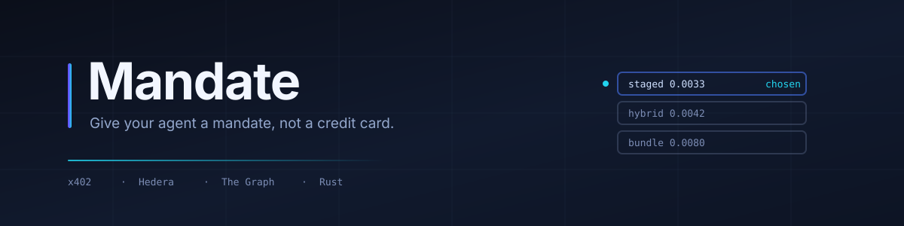
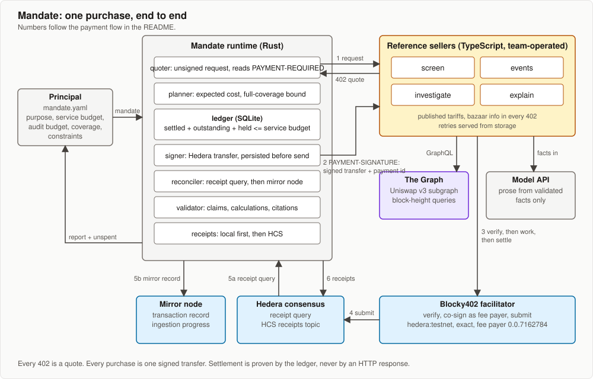

<div align="center">



# Mandate

**Give your agent a mandate, not a credit card.**

A buyer runtime for agents that pay per request. It plans what to buy, refuses
what it cannot justify, and proves every payment from the ledger.

[](https://github.com/mandate-run/mandate/actions/workflows/ci.yml)
[](LICENSE)
[](rust-toolchain.toml)
[](https://hashscan.io/testnet/topic/0.0.10410389)
[](docs/spec.md)

[Quick start](#quick-start) · [How it works](#how-it-works) · [Proctor](#proctor-the-harness) · [Docs](#documentation)

</div>

---

An agent handed a wallet will spend it. Mandate is the layer that decides
whether a purchase is worth making at all: given a purpose, a budget and hard
constraints, it collects live quotes, plans the cheapest path that can still
cover the whole task, reserves the final step, pays one signed Hedera transfer
per purchase, validates what it bought, and writes a receipt for every decision
to Hedera Consensus Service.

Built from scratch for ETHOnline 2026, entering Hedera AI & Agentic Payments,
Hedera Open Source, and The Graph AI Use Case.

## What makes it different

|  | |
|---|---|
| **Refuses before it spends** | When no plan can guarantee coverage, it stops and says what completion would cost, rather than half-buying evidence that answers nothing. |
| **The ledger is the truth** | Settlement is proven from the mirror node's records for its own transaction id. An HTTP response never moves money in the books. |
| **A lost response costs nothing** | The signed bytes are persisted before anything leaves the process, so a dropped response is retrieved with the original payment, never a second one. |
| **Its own arithmetic** | Every claim is computed from purchased facts. A model only writes prose, and every number in that prose is checked back against the evidence. |
| **Verified by an independent harness** | Proctor measures the seller's journal and the buyer's ledger, so a buyer that reports success while paying twice still fails. |

## Quick start

Prerequisites: Rust 1.98 with `protoc` on the path, Node 24 with pnpm 11, and
two Hedera testnet accounts from the [portal](https://portal.hedera.com). The
buyer needs its key and a few HBAR; the seller only receives, so its id is
enough. They must differ, because a transfer to yourself is one net movement
rather than a debit and a credit, and the runtime refuses to bind it.

```sh
cp crates/mandate/.env.example crates/mandate/.env   # MANDATE_ACCOUNT_ID, MANDATE_PRIVATE_KEY
cp sellers/.env.example sellers/.env                 # SELLER_PAY_TO
harness/scripts/setup
```

`setup` takes a clean clone to a settled run: it installs seller dependencies,
builds, creates a receipts topic on testnet, pins the served manifest and that
topic into the example mandates, and starts the sellers with canned Graph
facts. No API keys are needed.

```sh
cargo run -p mandate -- run examples/five-pools.hbar.toml --id demo-$(date +%s)
```

That buys evidence for five pools and settles three real payments on testnet,
printing the transcript as it happens: quotes, the three competing plans with
`expected` and `bound`, the reserve, each payment with its transaction id,
settlement read from the mirror node, per-pool outcomes, validation, totals and
the HCS sequence numbers. Add `--json` for the report as one document.

### See it refuse, adapt and recover

Each scene runs as one command, restarting the sellers with the fault it needs:

```sh
harness/scripts/demo 2   # a seller quotes below its ceiling; the plan flips to bundle
harness/scripts/demo 3   # the budget cannot cover any plan; it refuses before spending
harness/scripts/demo 4   # a seller quotes above its ceiling; it refuses that listing and re-plans
harness/scripts/demo 5   # the response is lost after settlement; it recovers without paying twice
```

`docs/demo.md` lists what each one puts on screen.

## How it works



| Component | Role | Built with |
|---|---|---|
| **mandate** | buyer runtime and CLI | Rust, own x402 types and exact-scheme signer on the Hedera SDK, SQLite |
| **sellers** | four x402-gated endpoints with published tariffs and durable result storage | TypeScript, `@x402/hedera` |
| **manifest** | listings and tariffs, pinned by the principal; each 402 also carries the x402 `bazaar` discovery info | JSON |
| **facilitator** | verifies and settles; fee payer `0.0.7162784` on testnet | Blocky402 |
| **proctor** | harness that checks payment behavior against executable contracts | Rust |

### The payment flow

1. The runtime sends the real request without payment. The seller answers 402 with amount, asset, `payTo`, `feePayer` and timeout.
2. It checks that quote against the pinned listing's recipient, asset, network and price ceiling, the facilitator's advertised fee payer, the mandate's constraints and the ledger invariant.
3. It builds a Hedera `TransferTransaction` with the facilitator as fee payer, signs it, generates the transaction id itself, and **persists the signed bytes before anything leaves the process**.
4. It moves the amount from held to outstanding and resends the request with a client payment id for idempotency.
5. The seller verifies through Blocky402, does the work, then settles. Blocky402 co-signs and submits.
6. The runtime proves settlement from the mirror node's records for its own transaction id, ignoring duplicates and requiring transfers that match the approved debit and credit. On a lost response it re-fetches with the same signed payment. An absent record keeps the amount reserved until reconciliation finds one.

Normative detail: [docs/spec.md](docs/spec.md), sections 3, 6 and 10.

### Assets

The asset is a field of the mandate, so one code path settles HBAR and any
fee-free fungible HTS token. A token with custom fees, a mutable fee schedule
or incomplete fee metadata is refused before signing, and settlement
reconciliation rejects extra debits on top of that.

```sh
cargo run -p mandate --example mint_token -- MUSD 50   # prints a token id
harness/scripts/token-run 0.0.10430010                 # that id
```

`token-run` restarts the sellers priced in that token, refetches the manifest
they now serve, pins its hash and your topic into the mandate, and runs it. All
three steps go together: a manifest names the asset its listings take, so a
mandate pointing at a stale one loads fine and matches nothing.

`examples/*.usdc.toml` are the same mandates priced in Circle's testnet USDC.
They are templates rather than exercised runs, because Circle's faucet never
delivered to the buyer account.

### Evidence from The Graph

All evidence is live data from the Uniswap v3 subgraph on The Graph Network,
id `5zvR82QoaXYFyDEKLZ9t6v9adgnptxYpKpSbxtgVENFV`, queried through the gateway
with a Subgraph Studio key. Sellers read token-denominated TVL at the window's
two observation blocks, hourly volume and transaction counts, and the largest
event above the materiality threshold, returning transaction hashes as
evidence. Every response states its block range, covered window, truncation and
indexing status.

The runtime computes per-pool outcomes and claims from those facts, decides
what to buy next, and checks the explanation against them. `Pool.liquidity` is
in-range liquidity: reported, never used for materiality.

Without a `GRAPH_API_KEY` the sellers serve canned facts, so a clean clone runs
with no accounts anywhere. Adding the key switches them to the live subgraph;
an `ANTHROPIC_API_KEY` switches the explanation from a template to a model.

## Proctor, the harness

Payment behavior is verified by a harness in [harness/](harness/), not only by
unit tests. Every check in a Proctor task contract has two halves: `expect`
reads the buyer's own report, and `observe` reads what Proctor measured itself
from the sellers' journal and the buyer's ledger.

That distinction is the whole point. A buyer with a recovery bug reports
`status: delivered` with correct totals while quietly paying twice. The
seller's journal shows six signed payments where the contract allows three.
Proctor caught exactly that defect during development, from the journal rather
than from anything the application said about itself.

```sh
cargo run -p proctor -- check harness/tasks/lost-response.toml --dir .
cargo run -p proctor -- run   harness/tasks/resume.toml --dir . --attempts 3
```

`check` runs a contract once. `run` hands each failure to a coding agent and
tries again, stopping at a pass, at the attempt limit, or at anything that
makes another attempt meaningless. Unresolved exposure never reaches an agent:
with money neither spent nor free, editing code and re-running could sign a
second payment against the first, which is the failure this harness exists to
catch.

Three contracts ship: a response lost after settlement, a resumed run that must
not repurchase, and a refusal that must leave the seller with no signed payment
at all. Design and the comparison with Hedera Harness: [docs/harness.md](docs/harness.md).

## Reference

**Exit codes.** `0` delivered · `2` a mandate or manifest that does not load ·
`3` refused · `4` delivered with findings · `5` withheld because
`anchor_before_delivery` is set and a receipt is not yet on HCS · `6` a payment
neither settled nor failed.

**Resuming.** A run that stops mid-purchase, whether the process died or a
response never came, is finished by `mandate resume <file> --ledger <path> --id <id>`.
It reconciles every open authorization against the mirror node, resends or
retrieves the bytes already signed, and carries on. Nothing is signed twice and
no purchase acquires a second payment id, so a crash costs at most one attempt.
`mandate reconcile <id>` re-reads the mirror node for anything left unresolved.

Every run needs a fresh mandate id, hence `--id`. The ledger is
`mandate.sqlite` unless `--ledger` says otherwise.

## Documentation

| File | Answers |
|---|---|
| [docs/mandate.md](docs/mandate.md) | Why this exists and where it goes |
| [docs/spec.md](docs/spec.md) | What the runtime must do; authoritative |
| [docs/threat-model.md](docs/threat-model.md) | What can go wrong, who stops it, what remains |
| [docs/harness.md](docs/harness.md) | What Proctor is, what it checks, and its boundaries |
| [docs/demo.md](docs/demo.md) | What the video shows, in order |
| [docs/requirements.md](docs/requirements.md) | Sponsor requirements, status and sources |

## License

Apache-2.0. See [LICENSE](LICENSE).
