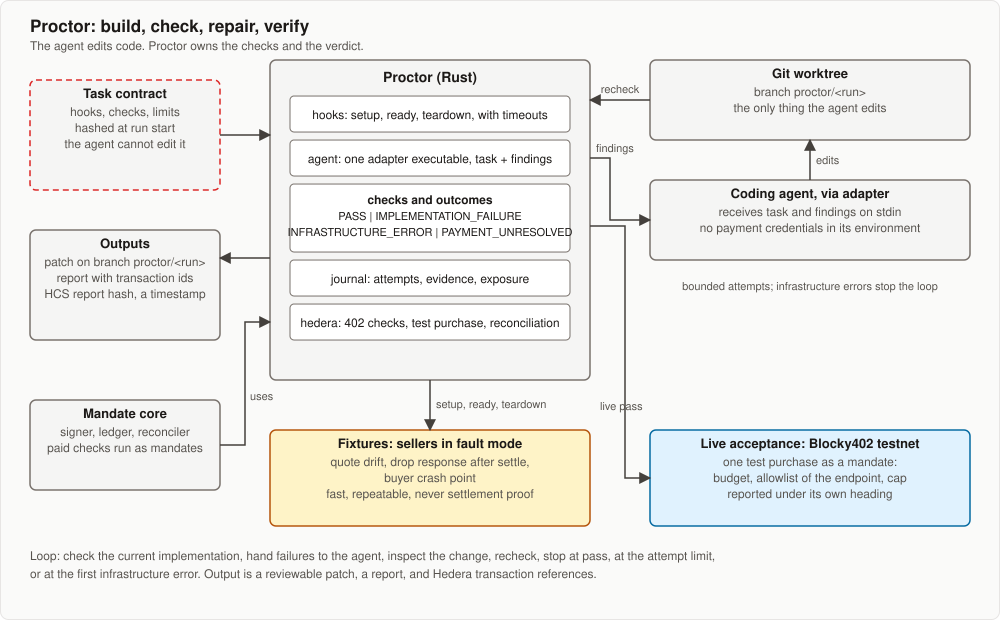

# Proctor

Working name. Proctor builds Hedera services from an acceptance contract, tests their behavior under payment failure, and returns a reviewable change with payment evidence. It is a standalone tool inspired by Hedera Harness and is Mandate's entry to the Hedera Open Source track. Mandate is the first project built with it.



**What is built.** `proctor check` and everything it needs: hooks, task
contracts, independent measurement from the seller journal and the buyer
ledger, and the four outcomes. `proctor run`, the agent loop, is not: it
prints that and exits 2, so the `[agent]` and `[live]` sections below and the
adapter are design, not schema. `harness/README.md` documents the contract
that ships; this document is why it is shaped that way.

## Why a second harness

Hedera Harness drives Cursor or Claude Code to build features into scaffold-hbar projects, Next.js with Hardhat or Foundry, and validates with static checks, Playwright, a semantic grader and an on-chain tier that completes testnet transactions from a burner signer. The official x402 end-to-end suite tests client, server and facilitator combinations across languages, Hedera included. Neither tests what happens between payment and delivery: a quote that drifts from the agreed price, a response lost after settlement, a process that dies after signing. Those behaviors decide whether an agent can be trusted with money. Proctor tests them and drives a coding agent to fix them.

| Difference | Proctor |
|---|---|
| Unit of work | An executable acceptance contract, not a product brief |
| Project type | Anything built and started from commands; Rust and Node services first |
| Oracle | The protocol and the ledger, observed independently of the application; no browser, no model-graded tier |
| Failure testing | Fault-injecting fixtures for quote drift, lost responses and restarts, plus a separately labelled live pass |
| Loop safety | Four outcomes with a fixed precedence; infrastructure errors stop the loop; the agent cannot alter the contract, the verifier or the fixtures |
| Paid checks | Run as mandates through Mandate core, with their own budget and durable ledger |

## Commands

- `proctor check tasks/<task>.toml` runs the contract once against the current implementation. No agent. A task with only protocol checks against a URL is the smallest task.
- `proctor run tasks/<task>.toml`, not implemented yet, runs the bounded loop: check, hand failures to the coding agent, inspect the change, recheck, stop at pass, at the attempt limit, or at the first infrastructure error. Output: a patch on branch `proctor/<run>`, a report, and transaction references.

## Independent measurement

The application under test is never its own oracle. Fixture sellers write a journal Proctor reads: for every request, the route, the payment id, the hash of the signed payment, whether settlement was called, and the hash of the result served. For live passes the mirror node record set is the observer. At a crash point Proctor also snapshots the application ledger after the process exits: transaction id, signed payload hash and reservation. A check has two parts: `expect`, assertions over the application's own output, and `observe`, measurements Proctor takes from the journal and the ledger. A check passes only when both agree.

Proctor, the verifier, the fixtures and the adapters live outside the worktree the agent edits. Their hashes, with the task's, are recorded at run start; a changed hash aborts the attempt.

## Task contract

Example, from the design. The shipped schema differs: hooks take a fault as a bare
argument rather than a flag, evidence paths are named under `[evidence]`, and there
is no `[agent]` or `[live]` section. `harness/README.md` has a contract that runs.

```toml
[task]
name = "recover a paid request after a lost response"
attempts = 3

[hooks]                       # commands with timeouts; output captured
setup = "scripts/sellers up --fault drop-response-after-settle"
ready = "scripts/sellers ready"
teardown = "scripts/sellers down"

[agent]
adapter = "adapters/claude-code"   # executable; task and findings arrive on stdin

[[check]]
name = "build"
run = "cargo build --workspace && pnpm -C sellers build"

[[check]]
name = "recovery"
run = "mandate run fixtures/lost-response.toml --json"
expect  = { authorizations = 1, submissions = 3, retrievals = 1, payment_state = "settled", delivery_state = "validated", outstanding = "0" }
observe = { fixture_signed_payloads = 4, fixture_distinct_payloads = 1, fixture_settlements = 1, served_hash_equals_result = true }

[[check]]
name = "restart"
run = "scripts/crash-after prepared && mandate resume --json"
expect  = { authorizations = 1, outstanding = "0" }
observe = { ledger_snapshot_at_crash = true, resumed_payload_hash_equals_snapshot = true, fixture_signed_payloads = 1 }

[live]                        # optional; reported under its own heading
facilitator = "https://api.testnet.blocky402.com"
mandate = "fixtures/live-acceptance.toml"
```

## Outcomes

| Outcome | What it covers | Loop |
|---|---|---|
| PASS | every check's `expect` and `observe` met | stop, report |
| IMPLEMENTATION_FAILURE | compiler or build errors, failed assertions, application crashes, malformed application output, a hook that runs project code and fails | findings to the agent; next attempt |
| INFRASTRUCTURE_ERROR | the verifier or a fixture crashed, a toolchain is missing, or the facilitator, mirror node or Graph gateway is unreachable by Proctor's own independent probe | stop; nothing goes to the agent |
| PAYMENT_UNRESOLVED | a live test purchase is neither settled, failed nor released | stop; exposure recorded in the journal; resume later |

Precedence when several apply: PAYMENT_UNRESOLVED, then INFRASTRUCTURE_ERROR, then IMPLEMENTATION_FAILURE. Timeouts, malformed verifier output and outages never become a pass.

## Initial scenarios

| Scenario | Fixture | Contract, in short |
|---|---|---|
| Quote drift | events seller quotes above its ceiling | refused OFF_TARIFF; plan re-chosen; journal shows no signed payment for the drifted quote |
| Lost response | seller settles, then drops the response to all three submissions | ledger shows one matching transfer; three submissions then one retrieval, all the same payload; journal shows one settlement; result recovered; budget columns match |
| Restart after authorization | buyer exits at state `prepared` through a test-only crash point | Proctor snapshots the ledger row; on resume the journal's payload hash equals the snapshot; no second authorization; budget intact |
| Restart before validation | buyer exits after the body is persisted, before validation | on resume the purchase is validated, not fetched again; no second authorization |
| Duplicate record | the mirror-node adapter returns a DUPLICATE_TRANSACTION record before the SUCCESS record for the id | payment settles on the SUCCESS record; the duplicate is ignored; exposure is never released early |

Fixtures are the reference sellers with fault switches, run locally. A live pass runs the same contract through Blocky402 on testnet with one real test purchase and is reported under its own heading. Fixture results are never presented as proof of settlement.

## Modules

| Module | Responsibility |
|---|---|
| hooks | run setup, ready, check and teardown commands with timeouts; capture output |
| agent | invoke one adapter executable with the task and the previous findings; one adapter first |
| checks | run checks, compare `expect` to application output and `observe` to journal and ledger, classify into the four outcomes |
| journal | persist attempts, hashes of task, verifier, fixtures and adapter, configuration, evidence, transaction ids and any unresolved exposure under `.proctor/runs/<id>/` |
| hedera | inspect 402 requirements, execute bounded test purchases as mandates through Mandate core, reconcile settlement from mirror record sets, optionally publish the report hash to HCS |
| observe | take the journal and ledger measurements a check compares against |
| task | load a contract, hash it, and reject one that names nothing to run |

Proctor depends on Mandate core for signing, reconciliation and the ledger. Mandate does not depend on Proctor.

## Boundaries

- The agent cannot approve changes to its own contract, verifier or fixtures. All are frozen per run. A wrong test is fixed in a separate change, never inside the attempt it would turn green.
- Infrastructure failure stops the loop. A facilitator outage never causes a rewrite of working payment code.
- Paid checks spend from a bounded test account under a mandate: allowlist of the endpoint under test, per-payment cap, durable authorizations. Restarting an attempt does not refill the allowance.
- Proctor starts every child, the agent adapter and the application under test, with an explicit allowlisted environment: `PATH`, `HOME`, `TERM` and the variables the task names. Payment credentials enter only the buyer process, from its own env file; they are never in the agent's environment. Proctor does not restrict the agent's filesystem access, so a coding agent that reads arbitrary paths can still find that file. A git worktree contains changes; it is not a security sandbox.

## Evidence and the video

`report.json` holds the tested facts: endpoint, request fingerprint, task and verifier hashes, network, checks with their `expect` and `observe` results, transaction ids, time. It is frozen before anchoring; `attestation.json` holds the HCS transaction and sequence number separately, so the report hash never changes after publication. The HCS message makes the report timestamped and identifiable; it does not prove a deployment still runs the tested code. The video segment is a two-attempt transcript from building Mandate: a first attempt that fails a recovery check, the agent's change, and a second attempt that passes with a live transaction reference. If development passes first time, the segment checks out the commit before the fix, lets Proctor catch it, and says so.

## Track mapping

| Requirement, quoted | How |
|---|---|
| "build new harness inspired by it" | Proctor, standalone, with the inspiration and differences documented above |
| "Public GitHub repo/PR with README explaining problem solved" | This document and the crate README |
| "Demo video (≤5 minutes) showing improvement" | The Proctor before-and-after segment of the project video |
| "Harness for uncovered language/framework" | Rust workspaces and Node services |
| "New service coverage" | x402 payment recovery on Hedera, HCS receipts, HTS association |
| "Clear before/after developer experience evidence" | Manual reproduction of a payment bug versus `proctor check`: reverting the recovery fix in a clone makes the resume task report six settlements where the contract allows three, and restoring it passes |

## Deferred

Seller certification, automatic account provisioning and sweeping, a plugin marketplace, more than one agent adapter, multi-agent orchestration, and an upstream PR unless something worth contributing appears.
